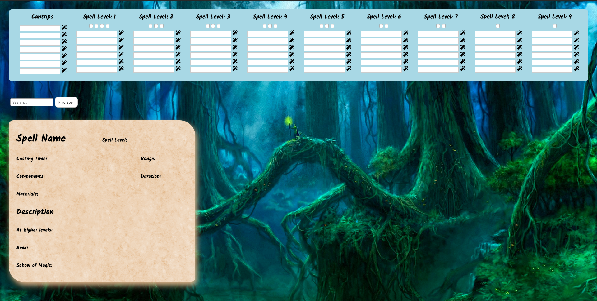

# D&D 5e Spell Dashboard

[Live Link](https://ladymicaela.github.io/dnd-spell-dashboard/frontend/public/index.html)

## Background

What could be more fun than combining two things you love doing? For me, those two things would be Coding and Dungeons and Dragons.

In my latest campaign, I am playing a snarky, badass magic wielder. However, keeping track of what spells I have, what they actually do, and how many spell slots I have left can be cumbersome. My solution...? A DnD Spell Dashboard!

## How it Works

Simply type out your spells in the appropriate spots, and keep track of your slots by checking off the checkboxes.

Forget what your spell actually does? Just click the wand next to it, and checkout its full description below!

You can also lookup spells you don't have by typing them into the search bar and clicking 'Find Spell'.

*NOTE: This is currently only a frontend app. In other words... if you refresh the page, anything you are tracking will be abracadabra'd away!*

## Technologies

This project was implemented with the following technologies:
* JavaScript
* React

## APIs

* [D&D 5e API](http://www.dnd5eapi.co/)